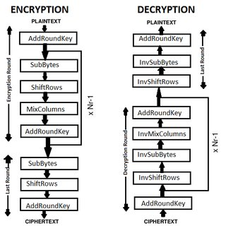
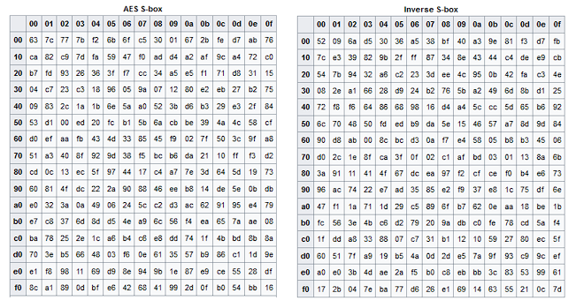

# AES128 Executed with PHP
Advanced Encryption Standard (AES) is a specification for the encryption of electronic data established by the U.S National Institute of Standards and Technology (NIST) in 2001. AES is widely used today as it is a much stronger than DES and triple DES despite being harder to implement.

The used secret key size is 128 bits (16 bytes) which means it takes 10 rounds to encrypt/decrypt the plain text.


1-  AES key expansion:

We first split the key into four blocks then on the fourth block “w[3]” we perform:
•	Circular byte left shift
•	Byte Substitution (S-Box)
•	XOR with round constant table = g(w[3]) 

Then we perform an XOR operation to generate 4 new blocks from the resulting g(w[4]) block, to form a new key:


by combing all of the blocks from w[4] to w[7]  we form the round key.

>**In encryption**: we generate new round keys along side each iteration of the state matrix to XOR them by each generated round key.

>**In decryption**: we generate all the round keys first, then we XOR the state matrix with the round keys in reverse order in each iteration (10 iterations since we’re using 128 bits).

2- Add round key to state matrix:

The state matrix is the plaintext (converted to HEX) in a 2d array form.
  
We simply perform XOR operation with current round key to create a new state matrix each round until a cipher is produced on the 10th round.

3- S-Box and Inverse S-Box:

  We simply substitute the bytes using Rijndael’ S-box
aquired from (https://en.wikipedia.org/wiki/Rijndael_S-box)




4- ShiftRow and Inverse Shiftrow:

This step is just as it sounds. Each row is shifted a particular number of times.

-	The first row is not shifted
-	The second row is shifted once to the left.
-	The third row is shifted twice to the left.
-	The fourth row is shifted thrice to the left.

5- Mix Columns and Inverse Mix Columns:

  (https://en.wikipedia.org/wiki/Rijndael_MixColumns)
   
   Each row in the state matrix is treated as a four-term polynomial, which are elements within Galois Field  GF(2^8).
  - we multiply by this matrix..
  
  
  
  - while in the inverse mix columns we multiply by the matrix..

  

After encryption/decryption:

the outputted text will be converted to a string of hexadecimals then converted back 
to binary text.

the way I implemented the addtion of bigger data isn't the most ideal way but it gets the job done!

```php
$strinput="Two One Nine Two";
$secret_key="SECRET";

$strinput = str_split($strinput,16);                                    //spliting string into 16 bytes (128 bit) per block.
for($i=0; $i<count($strinput); $i++)
{
    $strinput[$i] = str_pad($strinput[$i],16,'#',STR_PAD_LEFT);         //pads string into 16 bytes (128 bit) per blocks.
}

$ciphertext="";

$finaltext ="";
for($i=0 ; $i<count($strinput) ; $i++)
{
    $cipher = AES_ENCTYPT($strinput[$i], $secret_key);                 //sends the blocks to be encrypted indivisually all with the Key
    $cipher = hex2bin($cipher);
    $ciphertext= $ciphertext . $cipher;                                //adds each resulting cipher to a string.
}

echo "<br><br>----------------------------------------- Decryption<br>";

$ciphertext = str_split($ciphertext,16);                                //spliting cipher string into 16 bytes (128 bit) per block.

for($i=0 ; $i<count($ciphertext) ; $i++)
{
    $plain = AES_DECRYPT($ciphertext[$i], $secret_key);                 //sends the blocks to be Dencrypted indivisually all with the Key

    $plain = hex2bin($plain);
    $goodUrl = str_replace('#', '', $plain);
    $finaltext = $finaltext . $goodUrl;                                 //adds each resulting text to a string.
}
echo "<br> plainText: $finaltext";
```


 
